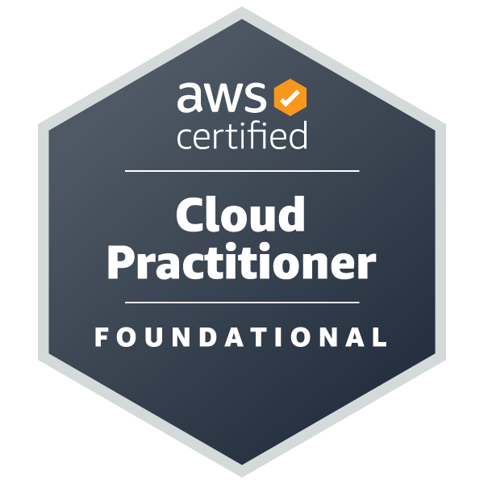

# Asfer's Cloud and DevOps Portfolio 🚀

---

## 📄 Summary
Motivated and skilled Cloud Engineer with certifications in AWS Cloud Practitioner and AWS Solutions Architect Associate. Proven hands-on experience in Docker, Kubernetes, Helm, CI/CD pipelines, and cloud infrastructure on AWS, Google Cloud Platform, and Microsoft Azure. Strong foundation in cloud computing and committed to driving innovation through efficient cloud-based solutions.

---

## 🎯 Objective
To leverage my technical expertise and cloud engineering skills within a dynamic organization, driving cloud solution design, implementation, and automation to optimize performance, scalability, and cost-efficiency.

---

## 💼 Experience

### 🌥️ Cloud Engineer Intern
**Cloudelligent** | Islamabad (July 2024 - October 2024)  
- Worked alongside DevOps tools, building intelligent solutions for AWS infrastructure management.
- Gained extensive hands-on experience with AWS tools related to DevOps practices.

### 🛠️ DevOps / Cloud Engineer
**MicroAgility Services Limited** | Islamabad (February 2023 - August 2023)  
- Developed cloud solutions on GCP and AWS, consistently leveraging Kubernetes, Docker, GitHub, and GitHub Actions for seamless automation and cloud management.

### 👷 Project & Process Manager
**Regional Contractor Services** | Islamabad & Multan (August 2020 - January 2023)  
- Managed the production process, ensuring quality standards, and handled stakeholder management, budget allocation, and negotiations.

### 👨‍💻 Associate Software Engineer
**Systems Limited** | Lahore (June 2019 - July 2020)  
- Applied AWS and other cloud services (Azure, GCP) to deliver cost-effective solutions using AWS CloudFormation, AWS Lambda, and AWS Step Functions.

### 🔌 Intern
**Pak Elektron Limited** | Lahore (June 2018 - August 2018)  
- Explored various components of the Energy Meter Plant and completed a Home Automation project using Bluetooth control.

---

## 🎓 Education

- **Master's in Engineering Management**  
  Ghulam Ishaq Khan Institute of Engineering Sciences and Technology, (2023 - 2025)  
  Courses: Engineering Management, Supply Chain, Operations Management, Marketing Engineering

- **Master's Cloud Computing - Cloud Architect**  
  Simplilearn (2022 - 2023)  
  Skills acquired: Architectural design principles on AWS, Azure, GCP, scalable applications deployment.

- **Bachelor’s in Electrical Engineering**  
  Ghulam Ishaq Khan Institute of Engineering Sciences and Technology (2015 - 2019)  

---

## 📜 Certifications

- **AWS Certified Solutions Architect – Associate**  
- **AWS Certified Cloud Practitioner**  
- **Google Project Management**  
- **McKinsey Forward Program**

---

## 🛠️ Skills

- **Cloud Platforms:** AWS, GCP, Azure  
- **Containerization:** Docker, Kubernetes, Helm  
- **CI/CD:** GitHub Actions, Jenkins  
- **Programming Languages:** Python  
- **Operating Systems:** Linux, Windows Server  
- **IaC:** AWS CloudFormation, Terraform  
- **Monitoring:** AWS CloudWatch  
- **Networking:** VPC, Security Groups, Load Balancers  
- **Project Management:** Agile, Risk Management, Stakeholder Relations

---

## 🔧 Key Projects

### 1. **Automated AWS EC2 WordPress Deployment with Terraform**
   - **Description**: Deployed a WordPress application on AWS EC2, with a fully automated setup using Terraform. Provisioned an EC2 instance, installed WordPress, and configured a MySQL database locally for seamless integration.
   - **Tools & Technologies**: Terraform, EC2, MySQL, Bash Scripting
   - **Key Features**: Utilized a user data script for automation, enabling a hands-off approach to application setup.

### 2. **Highly Available NGINX Server Deployment on ECS Fargate with ALB & EFS**
   - **Description**: Architected a resilient NGINX server deployment on Amazon ECS Fargate, managed with Terraform. Integrated an Application Load Balancer (ALB) for traffic distribution and Elastic File System (EFS) for persistent data storage, ensuring high availability and scalability.
   - **Tools & Technologies**: ECS Fargate, ALB, EFS, VPC, Terraform
   - **Key Features**: Designed with auto-scaling capabilities, fault tolerance, and persistent storage to support complex web applications.

### 3. **NGINX Load Balancer Setup on AWS EC2**
   - **Description**: Configured an NGINX load balancer on an AWS EC2 instance to distribute traffic to multiple backend EC2 instances. Documented and presented the setup steps with screenshots, focusing on configuration best practices.
   - **Tools & Technologies**: EC2, NGINX, VPC, Security Groups
   - **Key Features**: Enhanced fault tolerance and load balancing across backend servers, optimized for web applications requiring distributed access.

### 4. **ECS EC2 with EFS and Application Load Balancer using Terraform**
   - **Description**: Developed an ECS cluster running on EC2 with NGINX, integrated with an Elastic File System (EFS) for storage and an Application Load Balancer (ALB) for traffic distribution. Managed the infrastructure using Terraform, enabling version-controlled and reusable configurations.
   - **Tools & Technologies**: ECS EC2, ALB, EFS, CloudWatch Logs, Terraform
   - **Key Features**: Monitored with CloudWatch Logs for real-time performance insights, supporting applications requiring persistent storage and traffic handling.

### 5. **Continuous Deployment Pipeline for ECS EC2 using AWS CodePipeline**
   - **Description**: Set up AWS CodePipeline to deploy an application on ECS EC2 with continuous integration and deployment (CI/CD). Configured deployment triggers, artifact storage, and notifications to streamline the development workflow.
   - **Tools & Technologies**: AWS CodePipeline, ECS EC2, CloudFormation, S3, IAM
   - **Key Features**: Enabled zero-downtime deployments, automated versioning, and real-time feedback, optimizing the development lifecycle for cloud-based applications.

### 6. **ECS Fargate NGINX Server Deployment with Terraform**
   - **Description**: Deployed an NGINX server on Amazon ECS Fargate with minimal configurations using Terraform. Set up an ECS cluster, security groups, and networking to streamline deployment and management.
   - **Tools & Technologies**: ECS Fargate, Terraform, VPC, Security Groups
   - **Key Features**: Infrastructure-as-Code (IaC) approach, ensuring a repeatable and version-controlled deployment process for containerized applications.

### 7. **Deploying an Application on ECS EC2 with AWS CodePipeline (Manual Setup)**
   - **Description**: Manually configured AWS CodePipeline to deploy an application on ECS EC2, providing a comprehensive CI/CD setup. Included deployment approvals, rollback strategies, and artifacts stored in S3 for full control over the pipeline.
   - **Tools & Technologies**: AWS CodePipeline, ECS EC2, S3, IAM, CloudFormation
   - **Key Features**: Tailored CI/CD setup, allowing for manual adjustments and approvals in line with enterprise compliance requirements.

---

## 🎯 Future Goals

### 1. **Advanced Cloud Certifications**
   - **AWS Certified DevOps Engineer - Professional**: Aiming to achieve this certification to deepen my understanding of advanced CI/CD practices, operational automation, and monitoring on AWS.
   - **Google Cloud Professional Cloud Architect**: Planning to certify my expertise in Google Cloud Platform and expand my multi-cloud capabilities, focusing on architectural best practices.

### 2. **Master Kubernetes & Helm at Scale**
   - **Goal**: Attain a comprehensive understanding of Kubernetes cluster management and scaling with Helm in production environments.
   - **Objective**: Leverage Kubernetes for microservices architecture, refining skills in cluster monitoring, scaling, and security to support large-scale applications with complex requirements.

### 3. **Develop Expertise in Infrastructure as Code (IaC) and Automation Tools**
   - **Terraform Modules**: Build reusable Terraform modules to streamline infrastructure provisioning for various environments and improve deployment consistency.
   - **Ansible & Chef**: Expand knowledge of Ansible and Chef for configuration management and apply them to automate cloud infrastructure setup and application deployments.

### 4. **Explore Serverless Architectures and Edge Computing**
   - **Goal**: Design and deploy serverless architectures on AWS Lambda and Azure Functions to reduce infrastructure management overhead and improve scalability.
   - **Edge Computing**: Research and implement edge computing solutions to optimize application latency and performance, especially for IoT and real-time processing.

### 5. **Implement DevSecOps Practices**
   - **Objective**: Integrate security best practices into CI/CD pipelines, utilizing tools like AWS Security Hub, Twistlock, and Snyk for vulnerability scanning, compliance, and automated security checks.
   - **Focus**: Establish a DevSecOps culture within teams to ensure continuous security assessment and monitoring, even in high-speed deployment environments.

### 6. **Gain Hands-On Experience in Machine Learning Operations (MLOps)**
   - **Goal**: Develop a foundational understanding of MLOps and apply it in deploying machine learning models with automation pipelines, focusing on continuous training, model versioning, and scalability.
   - **Tools**: Explore SageMaker, MLflow, and Kubeflow to enable seamless integration of machine learning workflows within cloud infrastructure.

### 7. **Contribute to Open-Source Projects & DevOps Communities**
   - **Objective**: Actively participate in open-source DevOps and cloud projects on GitHub to stay current with industry trends, enhance collaborative coding skills, and build a professional network.
   - **Community Involvement**: Engage in DevOps and cloud engineering communities, attending conferences, meetups, and workshops to gain exposure to emerging technologies and methodologies.

